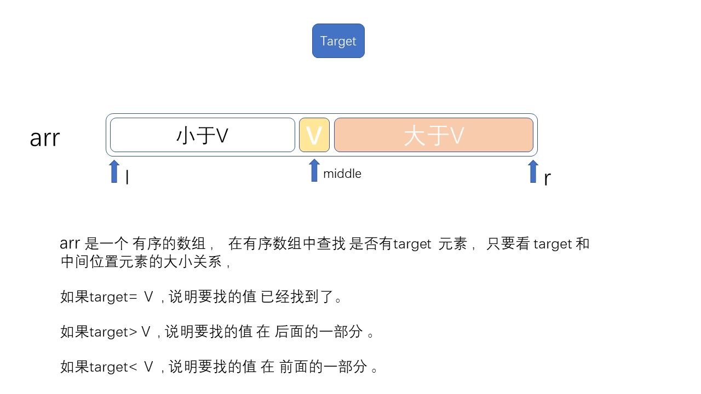
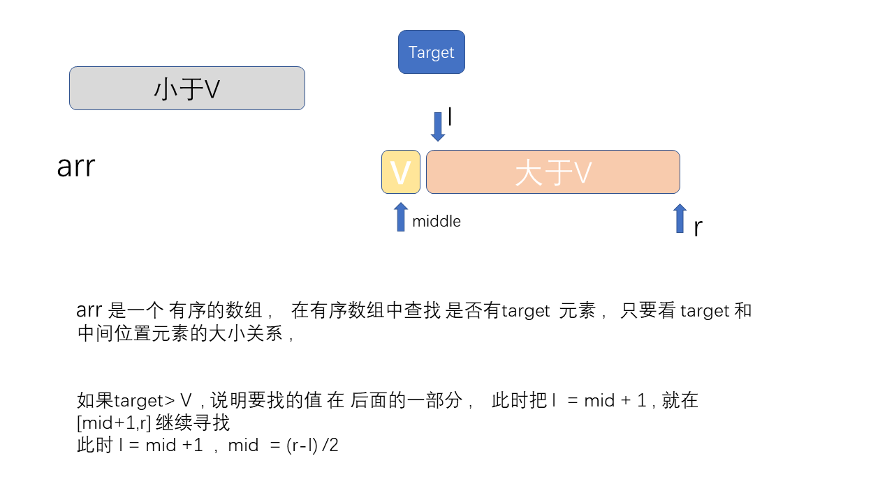
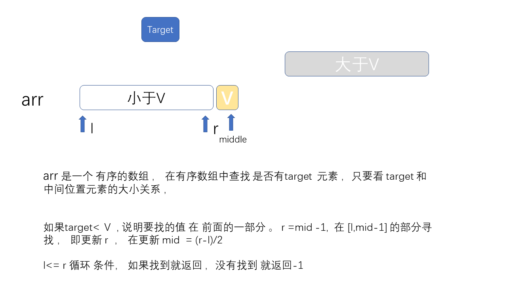
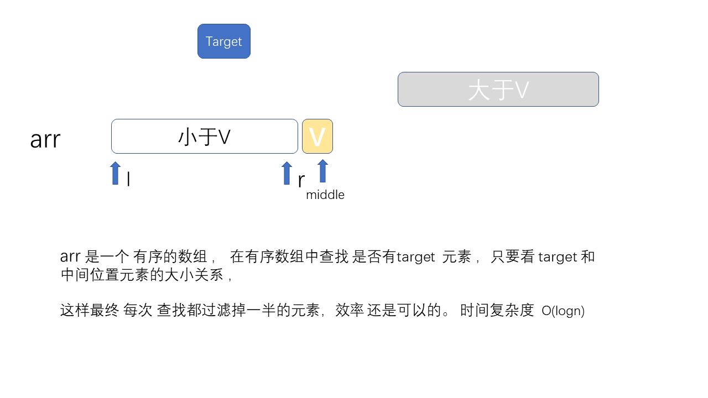

# 二分查找法 

## 二分查找法概述

 二分查找又称折半查找，优点是比较次数少，查找速度快，平均性能好；
其缺点是要求待查表为有序表，且插入删除困难。
因此，折半查找方法适用于不经常变动而查找频繁的有序列表。


## 算法思路 
首先，假设表中元素是按升序排列，将表中间位置记录的关键字与查找关键字比较，如果两者相等，则查找成功；
否则利用中间位置记录将表分成前、后两个子表，如果中间位置记录的关键字大于查找关键字，则进一步查找前一子表，
否则进一步查找后一子表。重复以上过程，直到找到满足条件的记录，使查找成功，或直到子表不存在为止，此时查找不成功。


总体思想 


发现target 大于中间值V，就到后半部分去找 有没有 target  


发现target 小于中间值 V，就到前半部分去找 有没有 target  





## 代码实现  
有两种实现 ，第一种递归的方式 ，第二种是非递归的方式 


递归方式如下：
```c++
template<typename T>
int __binarySearch2(T arr[], int l, int r, T target){

    if( l > r )
        return -1;

    // 防止极端情况下的整形溢出，使用下面的逻辑求出mid
    int mid = l + (r-l)/2;

    if( arr[mid] == target )
        return mid;
    else if( arr[mid] > target )
        return __binarySearch2(arr, l, mid-1, target);
    else
        return __binarySearch2(arr, mid+1, r, target);
}
```


递归方式如下：

```c++
// 二分查找法,在有序数组arr中,查找target
// 如果找到target,返回相应的索引index
// 如果没有找到target,返回-1
template<typename T>
int binarySearch(T arr[], int n, T target){

    // 在arr[l...r]之中查找target
    int l = 0, r = n-1;
    while( l <= r ){
        // 防止极端情况下的整形溢出，使用下面的逻辑求出mid
        int mid = l + (r-l)/2;

        if( arr[mid] == target )
            return mid;

        if( arr[mid] > target )
            r = mid - 1;
        else
            l = mid + 1;
    }
    return -1;
}

```
完整代码 [main.py](main.cpp)


