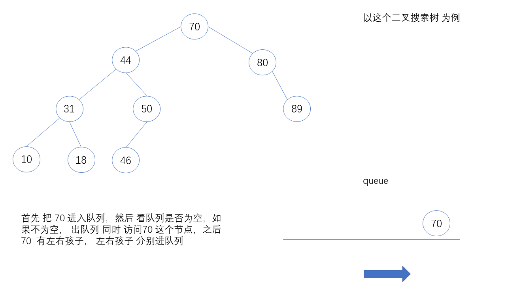
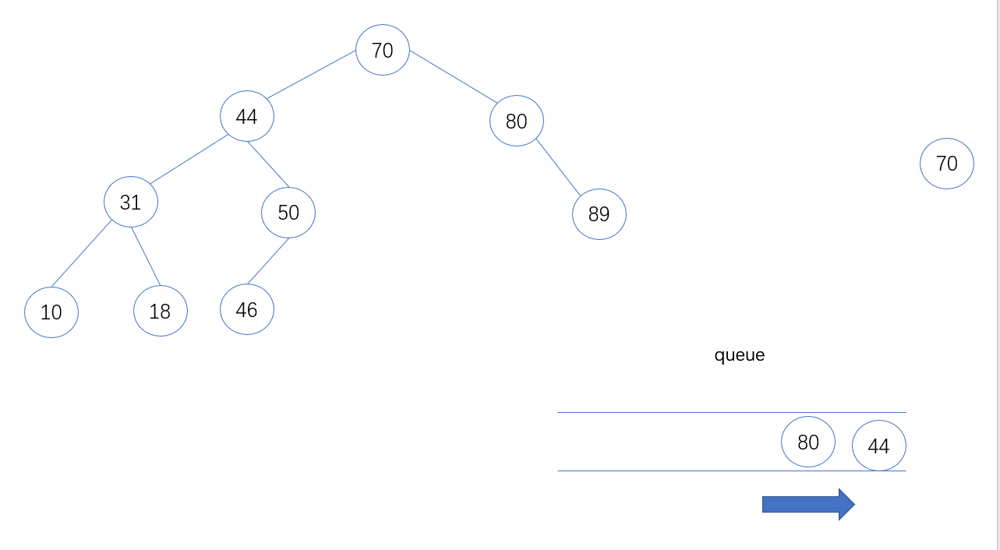
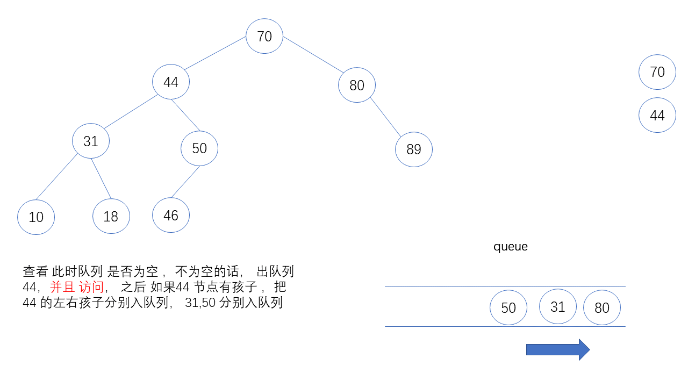
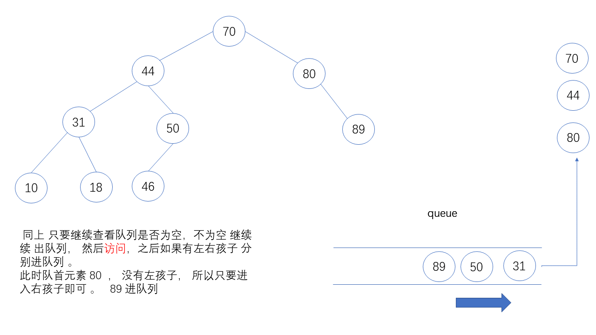
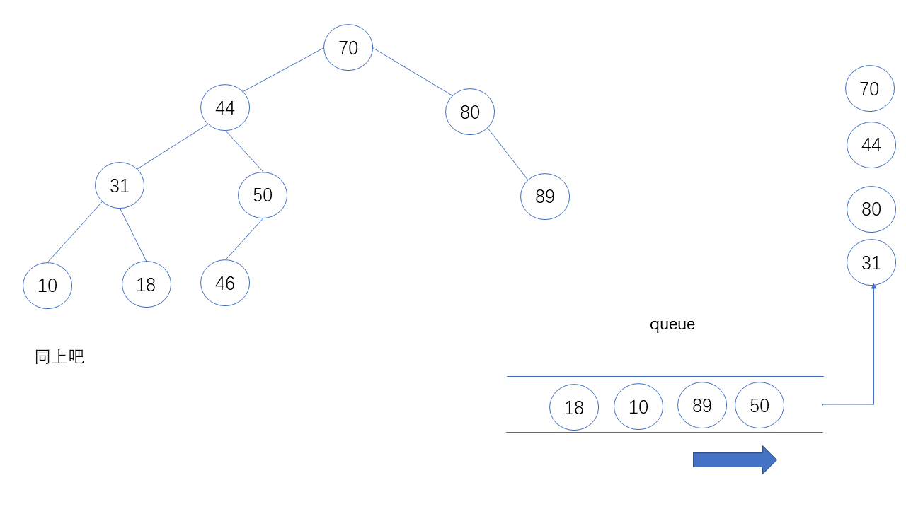
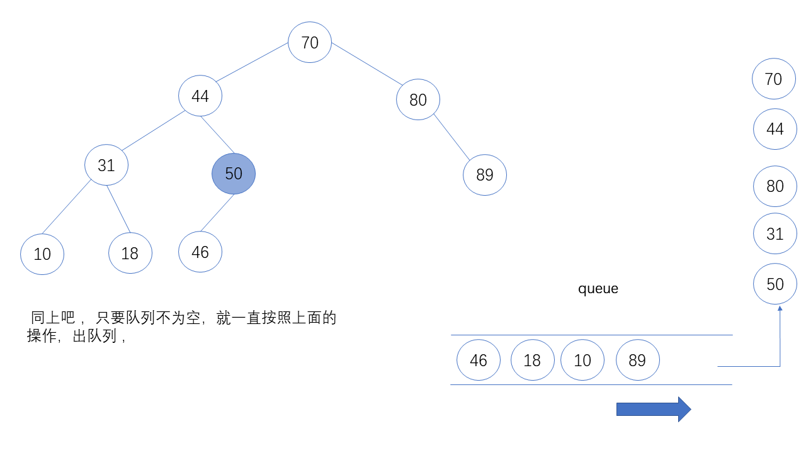
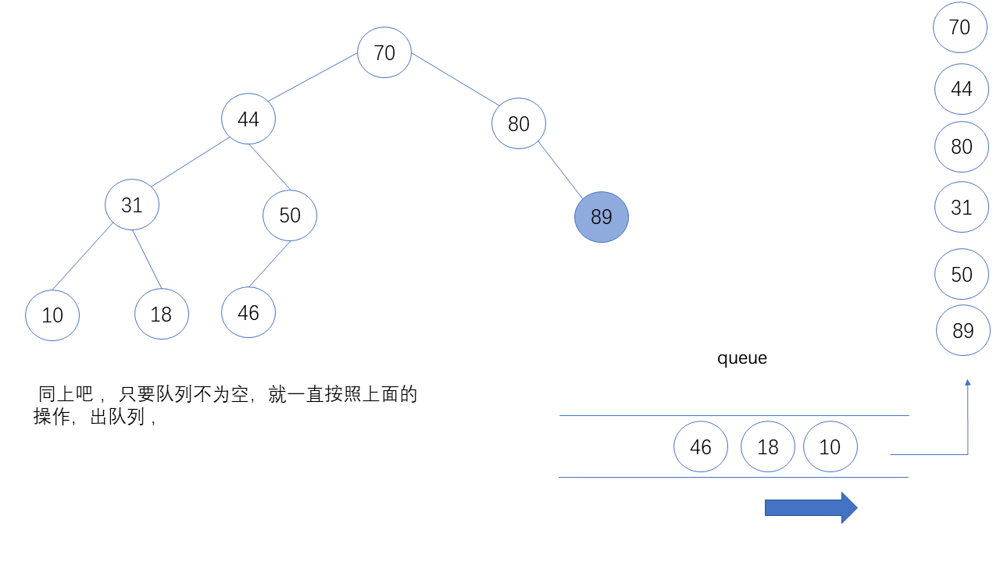
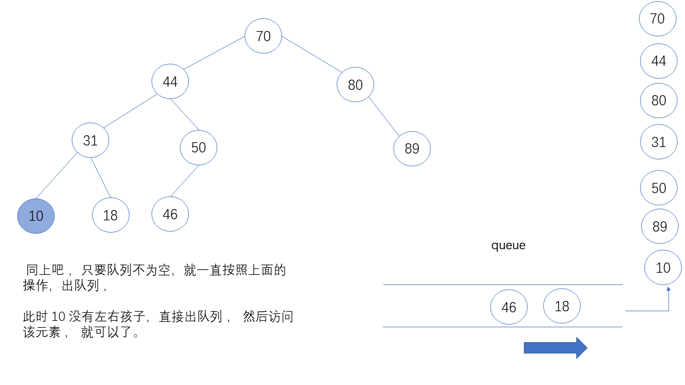
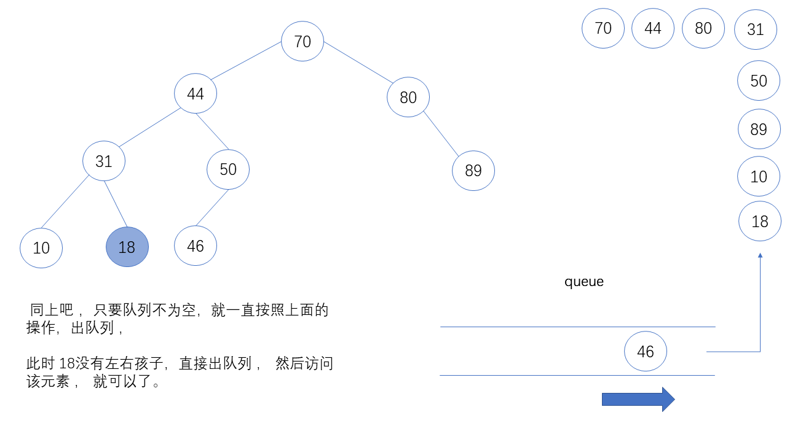
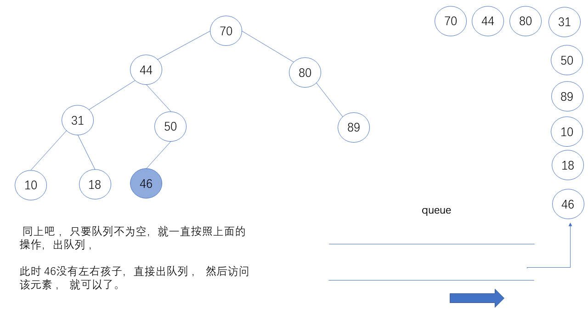

# 二叉搜索树

二叉搜索树  Binary Search Tree  是一种特殊的二叉树，又叫 二叉查找树，二叉排序树。


定义：  
1.要么二叉查找树 是一颗空树  
2.要么二叉查找树是由根节点，左子树，右子树组成， 其中 左子树 和右子树都是二叉查找树，且左子树上所有结点的数据域 都要 小于等于根结点的数据域，右子树所有结点的的数据域都要大于根结点的数据域。


从定义可以看出，二叉查找树 是一颗数据域有序的二叉树
并且 是一个二叉树 。 但不一定是一颗 完全二叉树。 


## 结构定义 


## 接口说明 

1. size() 获取当前二叉树的大小 
2. isEmpty() 判断是否为空树
3. insert(Key key,Value value)  
4. contain(key) # todo 
5. search(key) # todo 

6. inOrder() 中序遍历二叉搜索树
7. preOrder() 前序遍历二叉搜索树
8. postOrder() 后序遍历二叉搜索树
9. destroy() 方法实现 
10 levelOrder() 层序遍历二叉搜索树 
11. maximum()  寻找二分搜索树的最大的键值
12. minimum()  寻找二分搜索树的最小的键值


---

### 05-06详解 levelOrder

二叉搜索树 层序遍历，需要 借助 队列。

思路分析 ： 

1. 首先 先把 root 放进队列里面， 
2. 只要队列不为空，获取队列队首元素，进行访问访问，然后出队列 ， 然后看 有没有左孩子，如果有 进入队列 。 之后 再看 有没有 右孩子，如果有 放入队列中 。
3. 循环第二步 ，判断队列有没有空，没有空的话，继续第二步操作。


代码 如下
```c++
 /* 层序遍历 二叉搜索树 */
    void levelOrder() {
        //注意  不加空值检查 会有问题
        queue<Node *> q;

        if (root != nullptr) {
            q.push(root);
        } else {
            return;
        }
        while (!q.empty()) {
            Node *front = q.front();
            cout << "node <key,value> = " << "<" << front->key << "," << front->key << ">" << endl;
            // 删除 队列 首部元素
            q.pop();

            if (front->left) {
                q.push(front->left);
            }

            if (front->right) {
                q.push(front->right);
            }
        }
    }

```
 
 图片演示 如何通过这样 可以实现 
 












### 05-07 寻找二叉搜索树 最大的key，最小的key


如何找到 最大的结点呢？  
如果一个二叉搜索树，如下图，那么最大值，最小值必须在图中 的位置 


最小值 一定在 最左面的位置 


最大值 一定在 最右面的位置 


**代码实现**  
有两种方式 一种是 递归的方式，一种非递归的方式。


寻找最小值  
递归写法 
```c++
    /*
     * 返回 以node 为根结点 二叉搜索树 的最小结点
     *
     * 递归写法
     * */
    Node *minimum(Node *node) {

        if (node->left == nullptr) {
            return node;
        }
        return minimum(node->left);

    }
```

非递归写法 

```c++
    /*
      * 返回 以node 为根结点 二叉搜索树 的最小结点
      *
      * 非递归实现
      * */
    Node * minimum2(Node *node){
        while (node->left) {
            node  = node->left;
        }
        return node;
    }

```

寻找最大值 类似  
完整代码 见 [main.py->maximum ](main.cpp)