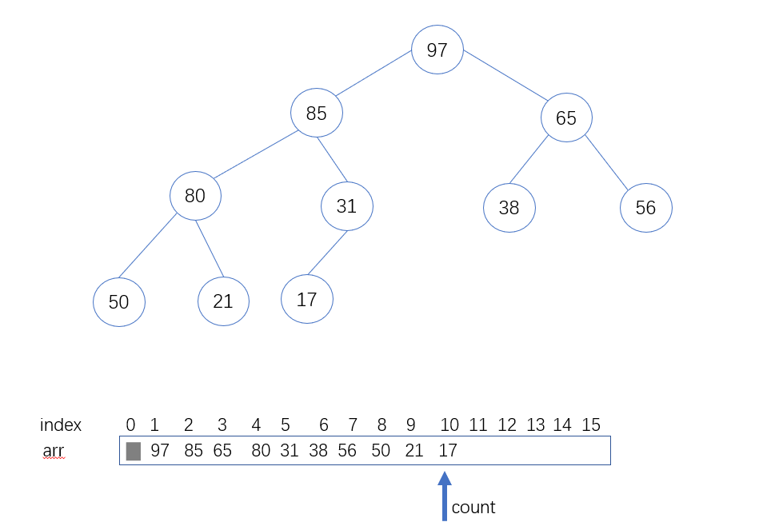
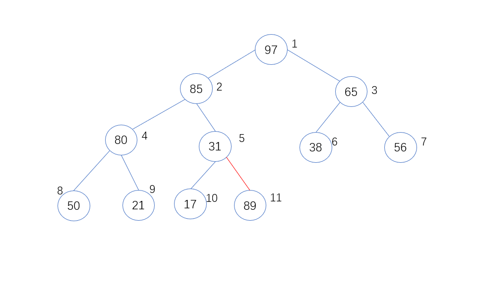
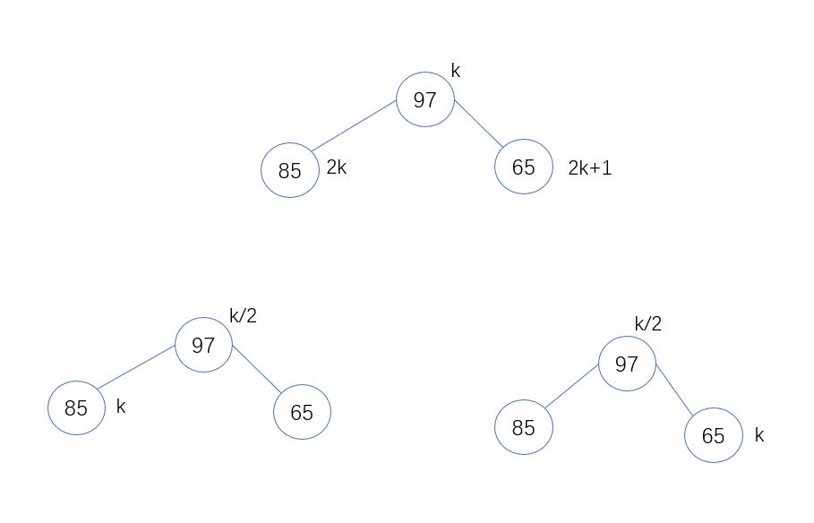
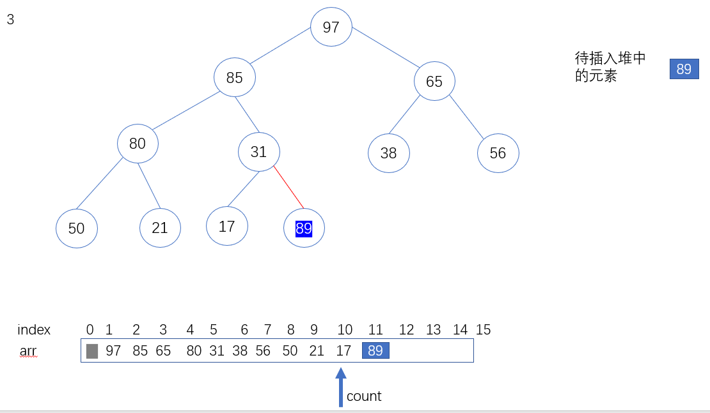
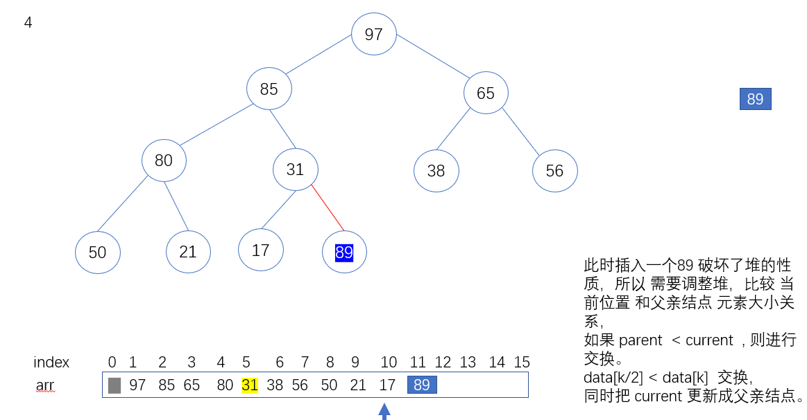
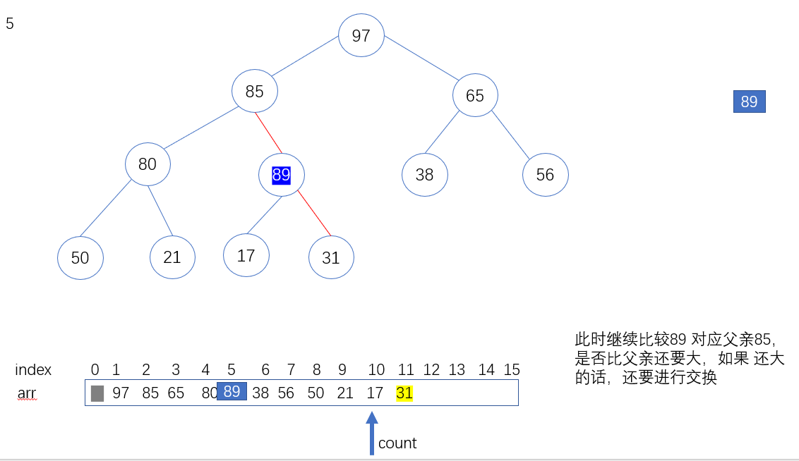
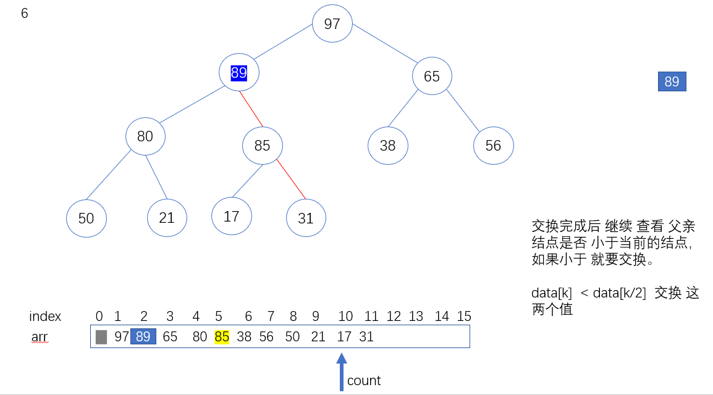
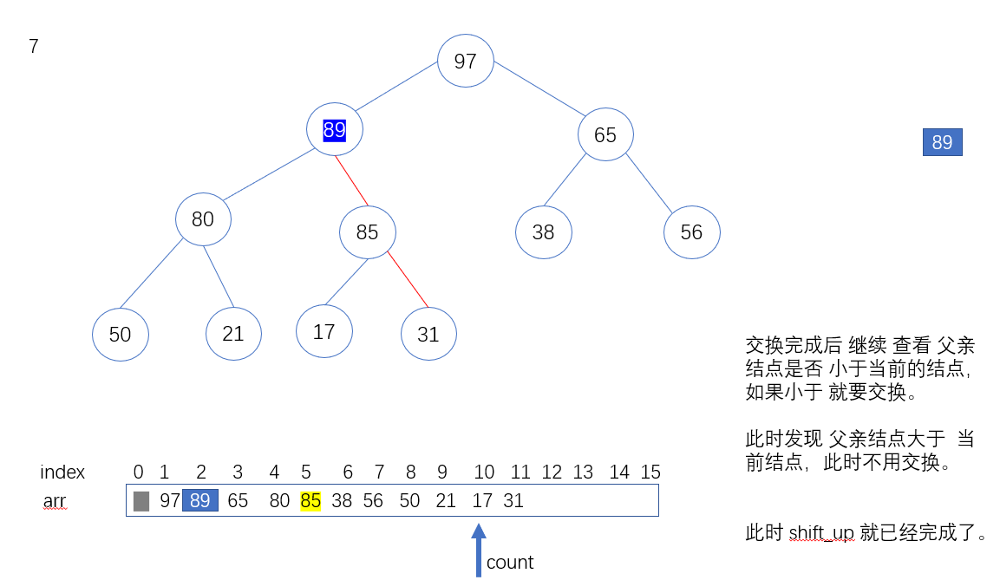
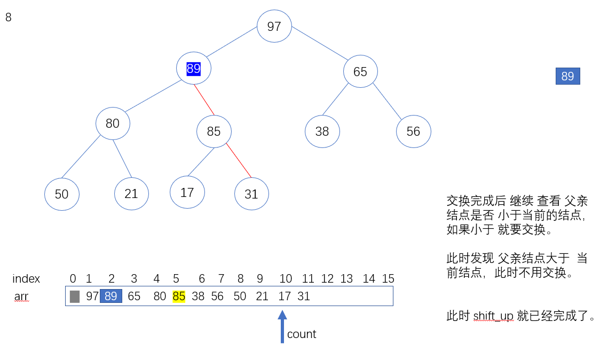
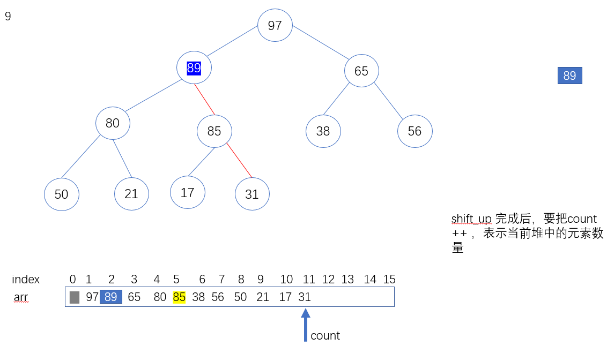

# 堆的数据结构

## 1 MaxHeap 数据结构定义  

> 第一个是 存放数据的数组，第二是 数据数量用 count 表示

```c++
template<typename Item>
class MaxHeap {


private:
    Item *data;  // 定义一个数组存放堆，从下标 1 开始
    int count;  // 记录当前堆的元素的个数
    int capacity; // 记录堆的最大容量， 这里的堆是不可扩展的堆，初始化后 最大容量就已经确定了。
}
```

## 1 接口定义 

说明 这里堆 的定义 数据从 小标为1 的地方开始 ，0号位置不用的。

1.返回堆中的元素个数
size() 这个来获取


2.判断是否为空队列 
isEmpty()

3.入堆操作
push(item) 将item 放入到堆里面，使之保持成大顶堆。


4.shift_up(int k)  将位置为k 的元素，调整成一个大顶堆的形式。使从 [1,k] 的元素 是一个大顶堆。

##2 shift_up 详解 

1 以一个例子说明 shift_up ,shift_up 是指在堆中插入一个元素，调整堆的过程，使之变成了一个堆，满足堆的性质。

由于堆的数据实际上是存放在数组里面的,这里的话，零号位置 暂时不用，下图是一个大顶推。


为了形象的看出儿子和父亲的关系 


此时父亲 和 儿子的小标表示 ：
比如 index=5  元素值 是31 ,其父亲对应索引 5/2 = 2   

如果 儿子 结点索引 k, 那么父亲结点索引就是 k/2 向下取整就可以了。 



2.以上面堆为例，讲解如何shift_up 操作，假设此时进来一个元素为89，显然如果89 直接放到数组的后面 肯定不满足堆的性质的。此时就要调整堆，
把89 往上 进行调整 



显然89 要大于 父亲结点31 的。所以要交换元素









进行调整后 ，此时发现父亲结点已经大于 儿子结点了



此时 shift_up 已经完成，整个堆已经调整完毕。



对于插入这个元素来说还要记得更新 count 的值，代表堆的当前数量。



## 看下push 操作的实现

```c++
    // 插入一个元素
    void push(Item item) {

        // 防止插入太多的元素 ，越界了。
        assert(count + 1 <= capacity);
        // 从小标 为1 的位置 ，开始放入元素
        data[count + 1] = item;
        shiftUp(count + 1);
        // 注意在这里维护 count 的值 自增1
        count++;
    }
```
实现并不复杂 ，直接把元素放到数组data 里面，然后开始进行shift_up 操作，操作完成后 把count ++ 即可。


shift_up 实现 
```c++
    void shiftUp(int k) {
        /*
         * parent 索引：   k/2
         * current 索引 ：  k
         * 循环条件k 值 大于1 即可 且   当前 的索引位置元素 小于 父亲结点的元素
         * ，就交换两个值，
         * 同时 更新 k  的值 变成 父亲的索引
         *
         * */

        while (k >= 2 && data[k / 2] < data[k]) {

            swap(data[k], data[k / 2]);
            k = k / 2;
        }

    }
```

