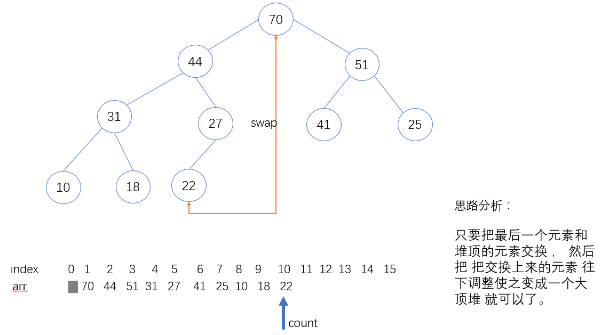
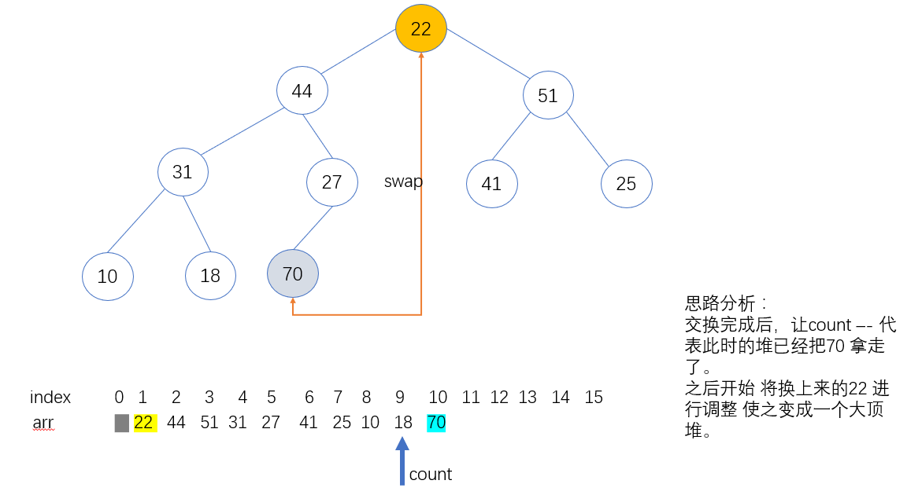
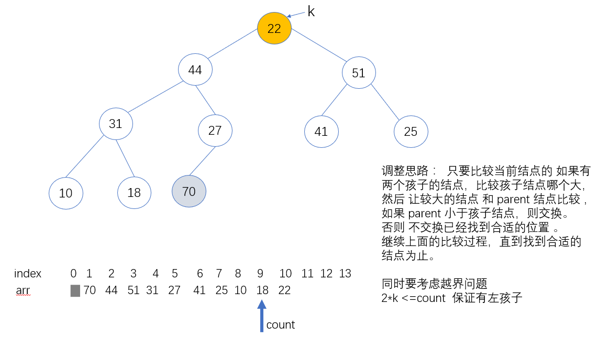
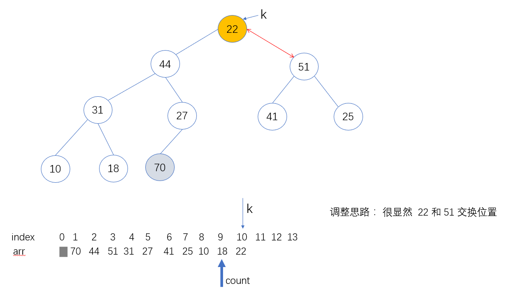
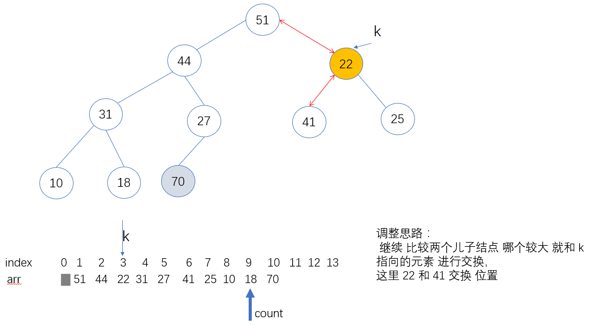
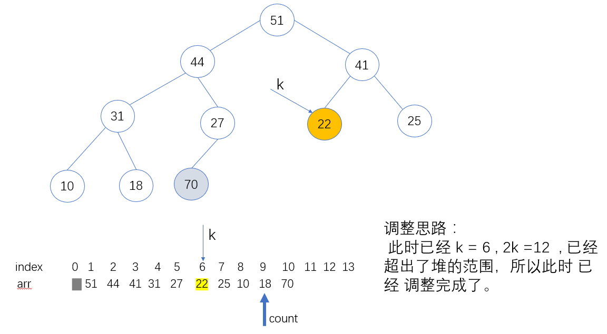
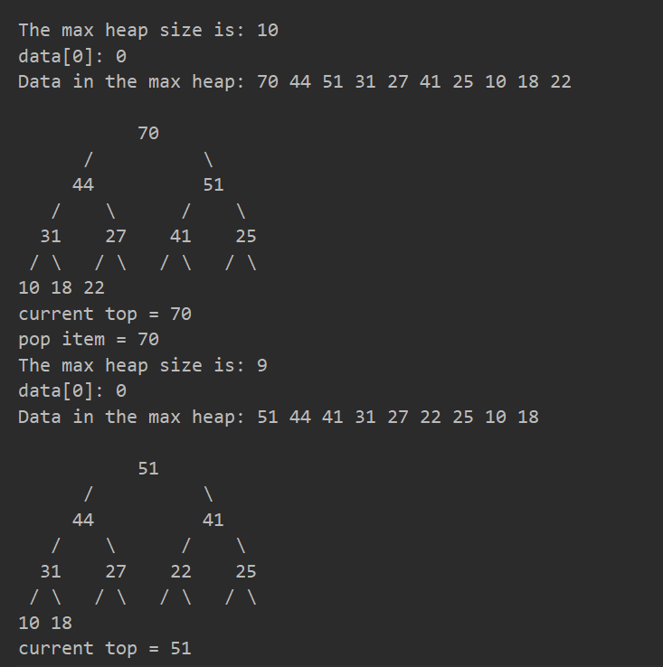

# 堆的数据结构

## 1 MaxHeap 数据结构定义  

> 第一个是 存放数据的数组 data 表示，  
> 第二是 数据数量用 count 表示，  
> 第三个 记录堆最大容量  用 capacity 表示

```c++
template<typename Item>
class MaxHeap {


private:
    Item *data;  // 定义一个数组存放堆，从下标 1 开始
    int count;  // 记录当前堆的元素的个数
    int capacity; // 记录堆的最大容量， 这里的堆是不可扩展的堆，初始化后 最大容量就已经确定了。
}
```

## 1 接口定义 

说明 这里堆 的定义 数据从 小标为1 的地方开始 ，0号位置不用的。

1.size()，返回堆中的元素个数


2.isEmpty() 判断是否为空队列 


3.push(item) 将item 放入到堆里面，使之保持成大顶堆，入堆操作

4.shift_up(int k)  将位置为k 的元素，调整成一个大顶堆的形式。使从 [1,k] 的元素 是一个大顶堆。  

5.pop() 弹出堆顶的元素，返回堆顶元素。改变堆的结构，堆的size 要减1 ，出堆操作。

6 getTop() 获取堆顶元素，不改变堆的结构 。

7.printHeap() 打印堆的形状


##2 shift_down 详解 

pop操作：
取出堆中的元素，直接 将 最后一个元素和 堆顶交换位置，把堆的size-- ， 然后 把最后一个元素 往下 调整，使变成一个大顶堆。

只要比较 当前的 结点 孩子结点的较大值 ，查看 是否大于当前结点 ，如果大于就交换，并且 更新 当前结点到 较大值孩子结点的索引 继续这样的操作，

否则 就完成了shift_down 操作。 

看下 下面的图片演示


以下面的堆为例演示 














## 代码

出堆操作 
```c++
    Item pop() {
        /*
         *   Pop the largest item off the heap, maintaining the heap invariant.
         *   出堆
         *  从最大堆中取出堆顶元素, 即堆中所存储的最大数据
        */

        Item largestItem = data[1];

        swap(data[1], data[count]);
        this->count--;

        shiftDown(1);
        return largestItem;

    }
```


shiftDown 操作
```c++

    void shiftDown(int k) {
        /*
        * 下移 元素把 元素调整成大顶堆 ，尝试调整 k 索引对应的元素，调整成 大顶堆
        * */
        // 首先要判断有没有做孩子，有左孩子 就说明 还没有到堆的最后一层
        while (2 * k <= count) {

            // 初始化 任务左孩子
            int j = 2 * k;//此轮 循环 是要找到 data[k]节点应该和 j的位置 互换

            if (j + 1 <= count && data[j + 1] > data[j]) {
                j = j + 1;  // 寻找较大的儿子结点
            }

            if (data[j] <= data[k]) {
                // 说明 已经 是大顶堆了，不用继续寻找下去了。
                break;
            }
            swap(data[j], data[k]);
            // 更新k
            k = j;
        }
    }

```

完整代码 [main.cpp](./main.cpp)
运行结果如下:

